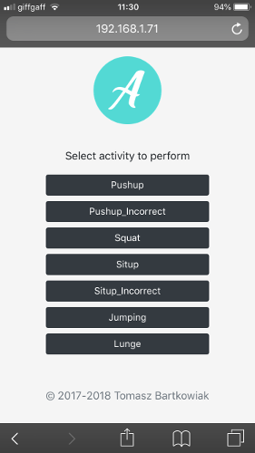
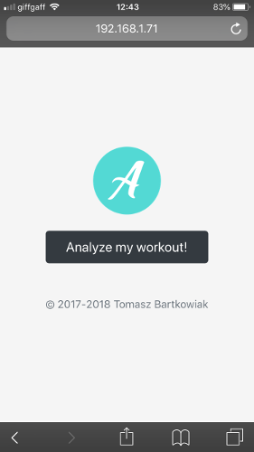
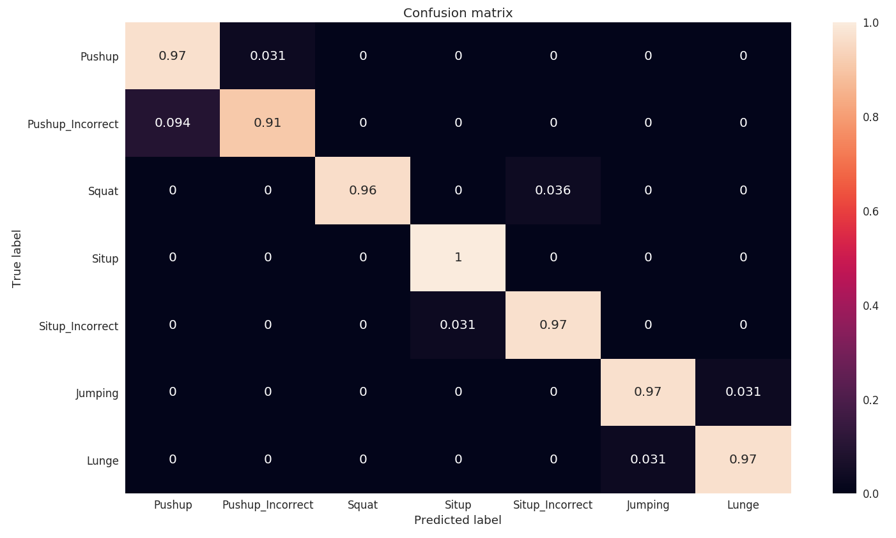
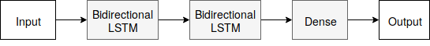
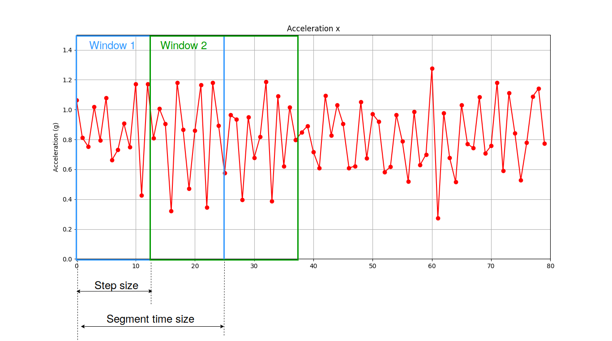
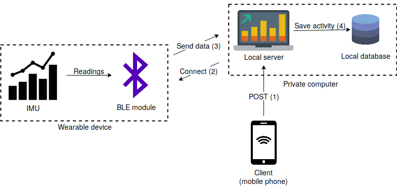
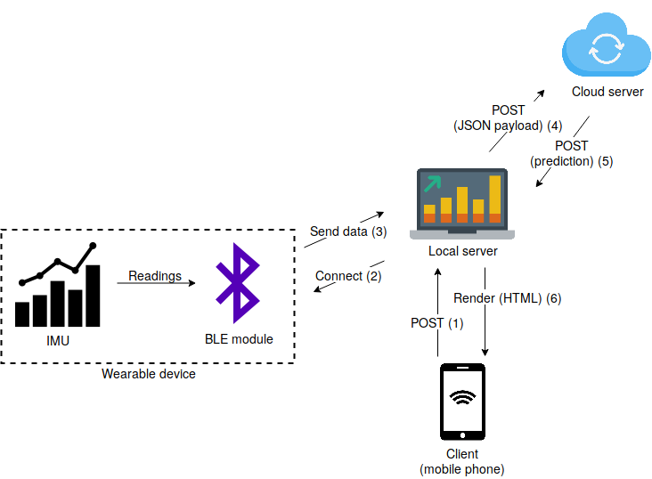

# Fitness-Activity-Classification-with-LSTMs

This repository contains code that was developed as a part of Master Thesis at Imperial College London *Movement Classification on Energy-efficient Sensor Using Neural Networks* written under the supervision of Dr Thomas Heinis.

## About
The project tackles the area of Human Activity Recognition (HAR) by utilizing Bidirectional LSTM (Recurrent Neural Networks) to build a robust classifier that recognizes fitness activities and classifies them as *correct* or *incorrect*. It achieved a performance of 96% and was built on a custom dataset consisting of over 11 thousand samples. The system recognizes seven different fitness activities: *Push-up, Push-up (incorrect), Squat, Sit-up, Sit-up (incorrect), Jumping, Lunge*. The data might be found in the `data_collected/`directory

The system is built in such a way that it can be easily adapted to custom datasets with arbitrary activities. It provides a web app *Data collection* that facilitates the data collection process. The *Analyzemyworkout* is a web application used for HAR classification.

*Data collection* application:  

  

*Analyzemyworkout* application:  

## Requirements
#####  Hardware: Inertial Measurement Unit equipped with BLE module (Here: Arduino LilyPad SimbleeBLE with MPU9250 IMU was used)
##### Software: Check file `requirements.txt`. Install with:

    pip install -r requirements.txt

## Results
The classifier achieved an overall accuracy of 96% (the model can be found in `models/` directory. The confusion matrix resulting from testing the classifier on the test set can be seen below:  

Yet the architecture is quite simple and consists of two stacked Bidirectional LSTM layers:  

The hyperparameters of the network were optimized using Bayesian optimization.

#### Data preprocessing
The data fed into the classifier is preprocessed using *Sliding window approach* where each sample after preprocessing is a single window composed of many raw samples (tuples of IMU readings, in case of 9DOF IMU - 9 numbers), as presented on a figure below:  

## Architecture
The repository consists of two systems: `Data collection system` and `Human Activity Recognition system` (aka *Analyzemyworkout*).

### Data collection system
Data collection system is a web app written in `Flask` that establishes BLE connection with a wearable device (motion sensor/IMU) and saves the data as a `.pckl` file. Its high-level architecture is presented below:  

### *Analyzemyworkout*
*Analyzemyworkout* is a web app written in `Flask` that establishes BLE connection with a wearable device (motion sensor/IMU), preprocesses data and sends to an external server for classification. After receiving the response (JSON), it renders that response on the client's browser.  

  

Its high-level architecture is presented below:  

